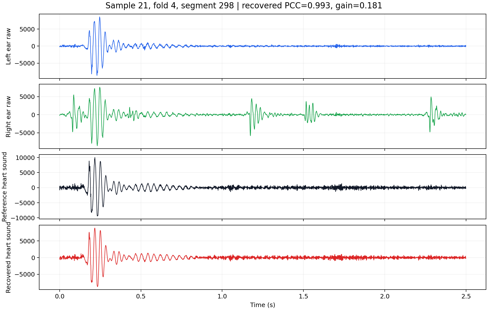

# DCUNet: Heart Sound Recovery from In-Ear Audio

This repository contains PyTorch code for reconstructing reference heart sounds from dual-channel in-ear recordings. The project includes the DCUNet recovery model, segment-mixed and subject-independent/few-shot continual learning protocols, ablation studies, baseline comparison experiments, SNR robustness tests, and scripts for generating waveform/audio demos.

The full dataset and trained checkpoints are not included in this repository. A small automatically selected demo gallery is included under `docs/demo_gallery/` to show waveform and audio examples.

## Repository Structure

```text
DCUNet-main/
  code/
    refine_continual_subject5fold_adaptation.py      # DCUNet model and refined few-shot adaptation
    train_segment_mixed_5fold_recovery.py            # segment-mixed 5-fold DCUNet recovery
    train_continual_subject5fold_adaptation_optimized.py
    train_segment_mixed_ablation_suite.py            # ablation experiments
    train_continual_model_ablation_suite.py          # continual-learning ablations
    train_compare_reconstruction_methods.py          # adapted baseline comparison models
    test_*_snr_robustness.py                         # SNR robustness tests
    evaluate_*                                      # metric recomputation and summary scripts
    build_demo_gallery.py                            # select high-PCC examples and export PNG/WAV demos
  docs/demo_gallery/
    demo_gallery.md                                  # waveform/audio demonstration page
    images/                                         # waveform comparison figures
    audio/                                          # short WAV clips for left/right/reference/recovered signals
  requirements.txt
```

## Data Format

The training and evaluation scripts expect processed NumPy files:

```text
data/process_data/merged_htzx_lez_2.5s/sample*_2.5s_filter_*.npy
shape = (segments, 3, 2500)
sample rate = 1000 Hz
segment length = 2.5 s
channel 0 = reference heart sound
channel 1 = left-ear raw signal
channel 2 = right-ear raw signal
```

Data and checkpoints are intentionally ignored by Git. Put them under `data/` and `results/` locally when reproducing experiments.

## Installation

```bash
pip install -r requirements.txt
```

For GPU training, install a PyTorch build matching your CUDA version from the official PyTorch instructions, then install the rest of the requirements.

## Main Commands

Segment-mixed DCUNet recovery:

```bash
python code/train_segment_mixed_5fold_recovery.py \
  --data-dir data/process_data/merged_htzx_lez_2.5s \
  --output-dir results/segment_mixed_5fold_recovery \
  --folds 5
```

Subject-independent few-shot DCUNet adaptation:

```bash
python code/train_continual_subject5fold_adaptation_optimized.py \
  --data-dir data/process_data/merged_htzx_lez_2.5s \
  --output-dir results/continual_subject5fold_adaptation_optimized \
  --support-list 72,96,120
```

Refined adaptation reusing existing base models:

```bash
python code/refine_continual_subject5fold_adaptation.py \
  --data-dir data/process_data/merged_htzx_lez_2.5s \
  --base-results-dir results/continual_subject5fold_adaptation_optimized \
  --output-dir results/continual_subject5fold_adaptation_refined \
  --support-list 72,96,120
```

Ablation experiments:

```bash
python code/train_segment_mixed_ablation_suite.py \
  --data-dir data/process_data/merged_htzx_lez_2.5s \
  --output-dir results/segment_mixed_ablation_suite \
  --variants all \
  --folds 5
```

Baseline comparison experiments:

```bash
python code/train_compare_reconstruction_methods.py \
  --experiment segment_mixed \
  --models all
```

More command examples are preserved in `code/*_commands.md`.

## Demo Gallery

The included demo examples were selected automatically by `code/build_demo_gallery.py` from held-out segment-mixed test folds using recovered PCC and improvement over the best raw input channel.

Open the full gallery here:

[docs/demo_gallery/demo_gallery.md](docs/demo_gallery/demo_gallery.md)

For embedded audio controls, use the GitHub Pages page in [docs/index.html](docs/index.html).

Example waveform comparison:



Audio clips for the same example:

- [Left-ear raw audio](docs/demo_gallery/audio/rank01_sample21_fold4_seg0298_left.wav)
- [Right-ear raw audio](docs/demo_gallery/audio/rank01_sample21_fold4_seg0298_right.wav)
- [Reference heart sound](docs/demo_gallery/audio/rank01_sample21_fold4_seg0298_reference.wav)
- [Recovered heart sound](docs/demo_gallery/audio/rank01_sample21_fold4_seg0298_recovered.wav)

GitHub renders PNG figures directly in Markdown. WAV files are shown as downloadable/playable links in most browsers after clicking the link. For embedded audio players, enable GitHub Pages from the `docs/` folder and open the generated site. The page uses standard HTML audio tags:

```html
<audio controls src="demo_gallery/audio/rank01_sample21_fold4_seg0298_recovered.wav"></audio>
```

In GitHub, go to `Settings -> Pages -> Build and deployment -> Source: Deploy from a branch`, select the main branch and `/docs` folder, then save.


## Citation

If this repository supports your work, please cite the associated paper or project entry. Replace this placeholder with the final BibTeX entry when the manuscript is available.
