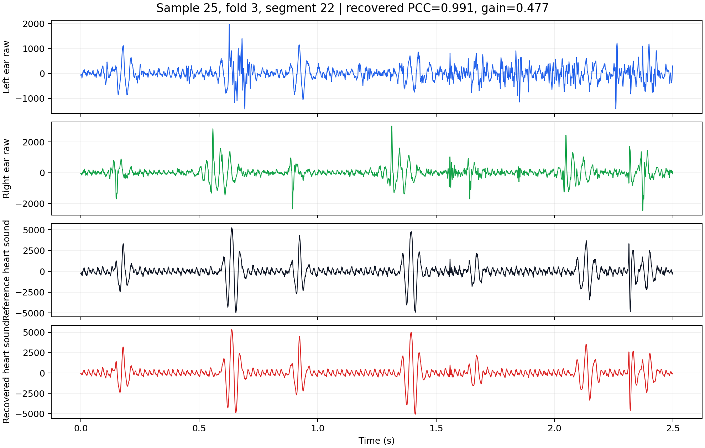
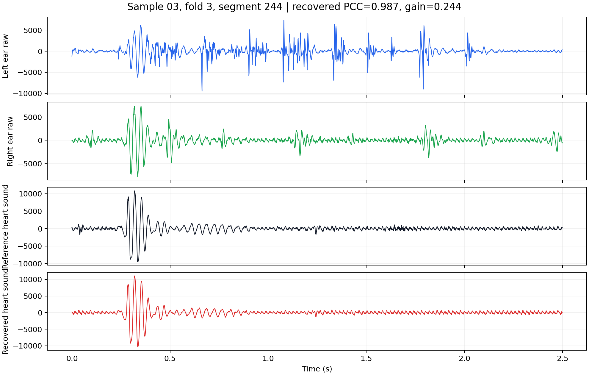
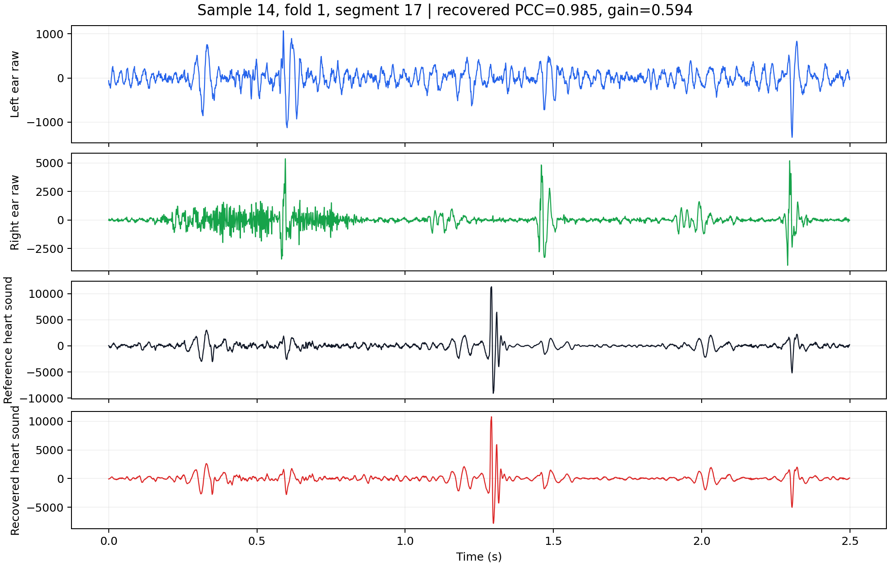
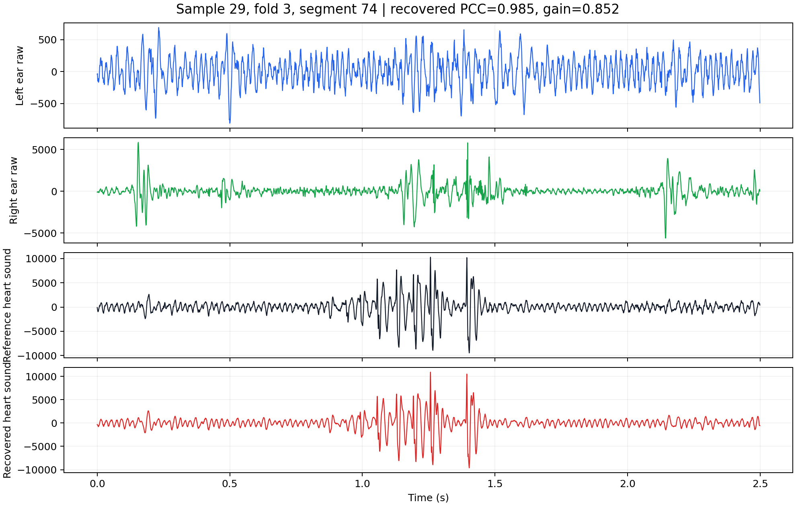
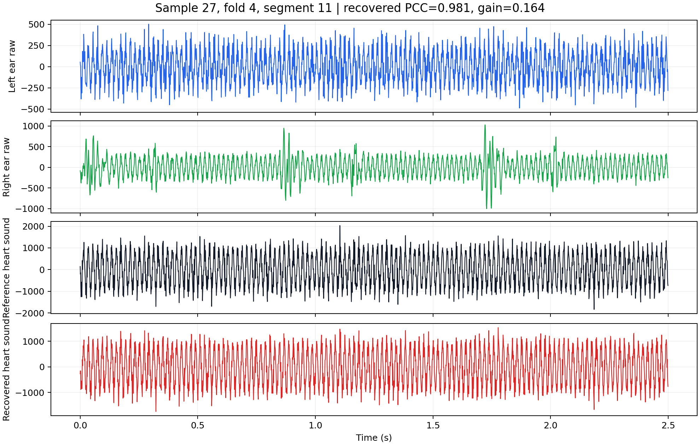

# Demo Gallery

These examples were selected automatically from held-out segment-mixed test folds by high recovered PCC.

## Example 1: sample 21, fold 4, segment 298

- Recovered PCC: 0.9928
- Left/right input PCC: 0.8118 / 0.6929
- Gain over best input PCC: 0.1810
- RMSE / MAE: 188.3788 / 129.1351

- [Left ear audio](audio/rank01_sample21_fold4_seg0298_left.wav)
- [Right ear audio](audio/rank01_sample21_fold4_seg0298_right.wav)
- [Reference heart sound](audio/rank01_sample21_fold4_seg0298_reference.wav)
- [Recovered heart sound](audio/rank01_sample21_fold4_seg0298_recovered.wav)

## Example 2: sample 25, fold 3, segment 22

- Recovered PCC: 0.9911
- Left/right input PCC: 0.5141 / -0.0378
- Gain over best input PCC: 0.4770
- RMSE / MAE: 137.5616 / 105.2546

- [Left ear audio](audio/rank02_sample25_fold3_seg0022_left.wav)
- [Right ear audio](audio/rank02_sample25_fold3_seg0022_right.wav)
- [Reference heart sound](audio/rank02_sample25_fold3_seg0022_reference.wav)
- [Recovered heart sound](audio/rank02_sample25_fold3_seg0022_recovered.wav)

## Example 3: sample 03, fold 3, segment 244

- Recovered PCC: 0.9868
- Left/right input PCC: 0.4590 / 0.7425
- Gain over best input PCC: 0.2444
- RMSE / MAE: 244.8703 / 155.2044

- [Left ear audio](audio/rank03_sample03_fold3_seg0244_left.wav)
- [Right ear audio](audio/rank03_sample03_fold3_seg0244_right.wav)
- [Reference heart sound](audio/rank03_sample03_fold3_seg0244_reference.wav)
- [Recovered heart sound](audio/rank03_sample03_fold3_seg0244_recovered.wav)

## Example 4: sample 14, fold 1, segment 17

- Recovered PCC: 0.9855
- Left/right input PCC: 0.3911 / 0.1536
- Gain over best input PCC: 0.5943
- RMSE / MAE: 173.7793 / 128.7206

- [Left ear audio](audio/rank04_sample14_fold1_seg0017_left.wav)
- [Right ear audio](audio/rank04_sample14_fold1_seg0017_right.wav)
- [Reference heart sound](audio/rank04_sample14_fold1_seg0017_reference.wav)
- [Recovered heart sound](audio/rank04_sample14_fold1_seg0017_recovered.wav)

## Example 5: sample 29, fold 3, segment 74

- Recovered PCC: 0.9854
- Left/right input PCC: 0.0196 / 0.1330
- Gain over best input PCC: 0.8524
- RMSE / MAE: 281.2403 / 206.6701

- [Left ear audio](audio/rank05_sample29_fold3_seg0074_left.wav)
- [Right ear audio](audio/rank05_sample29_fold3_seg0074_right.wav)
- [Reference heart sound](audio/rank05_sample29_fold3_seg0074_reference.wav)
- [Recovered heart sound](audio/rank05_sample29_fold3_seg0074_recovered.wav)

## Example 6: sample 27, fold 4, segment 11

- Recovered PCC: 0.9811
- Left/right input PCC: 0.8171 / 0.7808
- Gain over best input PCC: 0.1640
- RMSE / MAE: 138.0267 / 110.1300

- [Left ear audio](audio/rank06_sample27_fold4_seg0011_left.wav)
- [Right ear audio](audio/rank06_sample27_fold4_seg0011_right.wav)
- [Reference heart sound](audio/rank06_sample27_fold4_seg0011_reference.wav)
- [Recovered heart sound](audio/rank06_sample27_fold4_seg0011_recovered.wav)
